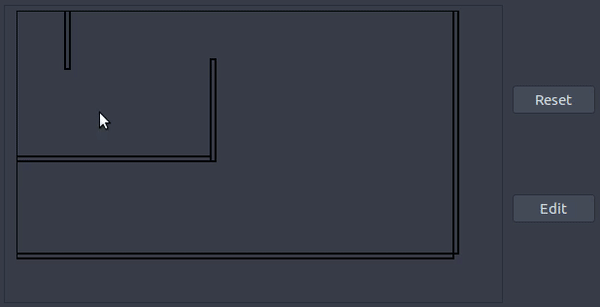

# Drone swarm simulation

DroneSwarm is a last year project for swarm behaviour simulation in an obstructed environment implemented in C++. It provides an environment for:

- Adding moving objects linked together (swarm)
- Defining a target that the agents will try to reach
- Setting up a solid environment


## Installation

This program was built for Unix system. The only dependency to get the simulation running is gtk3 (requirement for the interface).

```bash
sudo apt-get update && sudo apt-get install build-essential libgtk-3-dev
git clone https://github.com/frgfm/drone-swarm.git
```

## Usage

As the core code is in C++, you will need to compile it with g++ (with c++11 support). If this is not the case, please modify your own version of the Makefile.

```bash
cd drone-swarm
make all && ./demo
```




## Features to be improved

Some methods of the simulators could be improved and optimized to speed up computation time and boost performance. Better path finding algorithm could be used also: 

- Path finding algorithm
- Acceleration in movement for continuous speed
- Mouse interface for environment definition
